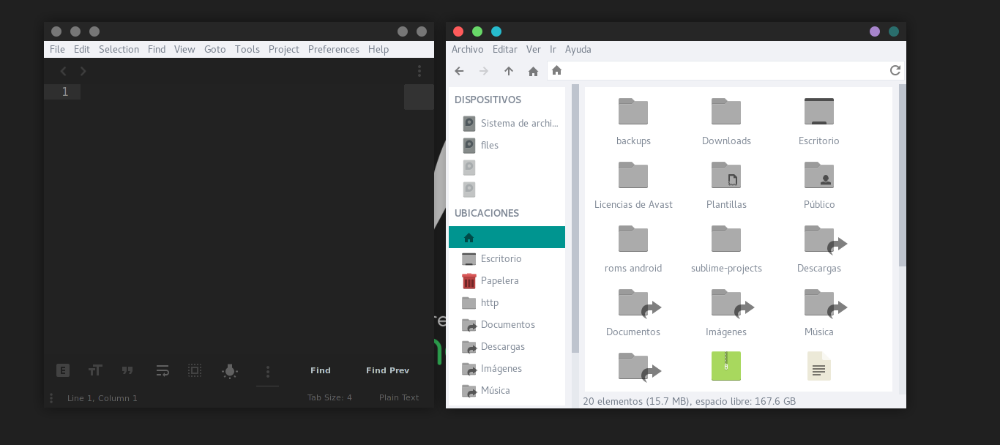
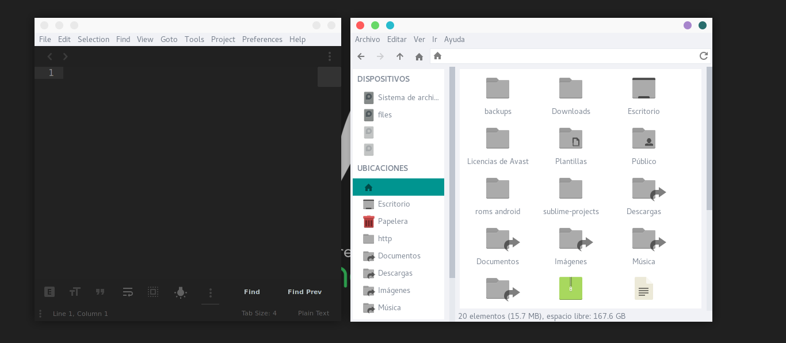
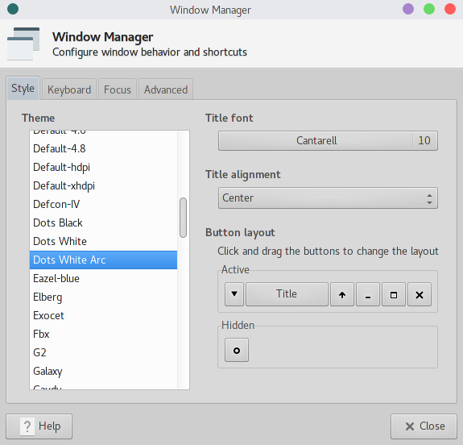

# Dots theme
##### A xfwm4 theme for xfce

Black and White theme

# Installation

* Clone the repo to your *home* directory `git clone https://github.com/rafacuevas3/dots-theme.git`
* Move your favourite themes to *~/.themes/* folder `sudo mv ~/dots-theme/* ~/.themes/ && rm -rf ~/dots-theme` and enter the password
* And go to **Window Manager** in **Settings** and select the *Theme* and Enjoy

